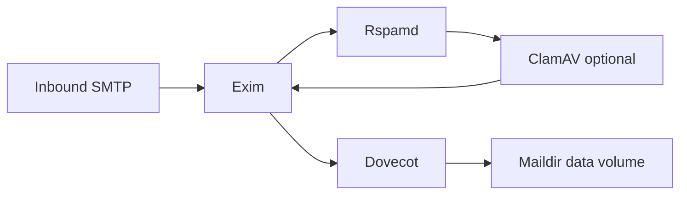

# Mail stack: goals, docker-mailserver, and incremental hardening

This document records **architecture decisions** for the Dokploy control-plane mail integration: the data plane runs **docker-mailserver** (Postfix + Dovecot + optional filters) with **Roundcube** webmail, and optional **Rspamd / ClamAV** toggles via the image.

Orchestration only: the app does not ship mail daemon or Roundcube source; see [THIRD_PARTY_LICENSES.md](../THIRD_PARTY_LICENSES.md).

---

## 1. Clarify goals (bundled vs single-image vs minimal)

| Goal | What it optimizes for | Typical stack | Trade-offs |
| ---- | --------------------- | ------------- | ---------- |
| **A. Minimal composable** | Small images, clear boundaries | Historical: separate Dovecot + Exim + Roundcube | Superseded by **C** in this repo. |
| **B. Defense in depth** | SMTP abuse resistance, spam scoring, optional malware scanning | Add Rspamd (and optionally ClamAV, Fail2ban) alongside the MTA | More CPU/RAM, tuning, false positives; more moving parts. |
| **C. Single mail appliance** | One upstream-maintained image, batteries included | [docker-mailserver](https://github.com/docker-mailserver/docker-mailserver) (Postfix + Dovecot + optional Rspamd, ClamAV, Fail2ban) | Different MTA (**Postfix** vs **Exim**), different config contract than “three global flat files + HUP”. |

**Current choice:** **C** — one **docker-mailserver** container (`mailserverContainerName`, default `dokploy-mailserver`), **Roundcube** on the same Docker network, provisioning via **`setup` CLI** (`exec` from the control plane), TLS from Traefik ACME stores copied into `mailDmsConfigDir/ssl/`, DKIM via `setup config dkim` and OpenDKIM `mail.txt` on the host mount ([reload-mail.ts](../packages/server/src/services/docker/reload-mail.ts) restarts postfix/dovecot inside DMS).

**When to tune docker-mailserver:** use image env vars (SpamAssassin, Fail2ban, ClamAV, etc.) and upstream docs.

**When to prefer a separate Rspamd service (B):** only if you outgrow the bundled options and accept operating a second container.

---

## 2. Implemented: docker-mailserver integration

### 2.1 What the panel does

| Concern | Implementation |
| ------- | ---------------- |
| Mailboxes | Postgres metadata + Argon2 hash for UI; live auth in **DMS** via `setup email add` / `update` / `del` ([mail/index.ts](../packages/server/src/services/mail/index.ts), [dms-setup-exec.ts](../packages/server/src/services/mail/dms-setup-exec.ts)) |
| Aliases + catch-all | `setup alias add` then `reloadMailServices` (supervisor restart postfix + dovecot in DMS) |
| DKIM | `setup config dkim …`, read `mailDmsConfigDir/opendkim/keys/<apex>/mail.txt`, Cloudflare/BIND DNS rows |
| TLS | `extractMailTlsFromAcmeJson` merges **default + Cloudflare** ACME JSON; PEMs under `mailTlsDir` and **`mailDmsConfigDir/ssl/`** for `SSL_TYPE=manual` |
| Compose / bootstrap | [docker-compose.yml](../docker/core-services/docker-compose.yml), [bootstrap-core-services.ts](../packages/server/src/services/docker/bootstrap-core-services.ts) |

Default mail container name: **`dokploy-mailserver`** (`PANEL_MAILSERVER_CONTAINER`).

### 2.2 Historical note (flat files)

Older revisions used global `passwd` / `virtual` under `mailAuthDir` and separate Exim/Dovecot containers. That path is **removed**; [mail-flat-files.ts](../packages/server/src/utils/mail/mail-flat-files.ts) may remain only for reference or one-off tooling.

---

## 3. Optional: extra Rspamd / ClamAV (reference)

**Superseded for the default stack** by docker-mailserver’s bundled options. This section kept as a **reference** if you run a custom MTA or sidecar.

### 3.1 Architecture (target state)

Exact chaining depends on Exim build: **milter** to Rspamd is common in full Exim builds; the **reference** `tianon/exim4` image may be minimal — production may require an image (or Dockerfile) with **Exim + milter** support enabled, or a front SMTP proxy. Treat this as an **integration checklist**, not a guarantee against stock `tianon/exim4`.

### 3.2 Compose (sketch)

- Add services on the **same** Docker network as `dokploy-mailserver` ([mailNetworkName](../packages/server/src/constants/server-paths.ts)).
- Mount Rspamd config (and optional ClamAV socket or TCP) from host paths under e.g. `apps/dokploy/.docker/core-services/mail/rspamd` so the panel **could** generate policy later.
- Pin image versions; document resource limits (Rspamd ~512MB+, ClamAV significant RAM for virus DB).

### 3.3 Control-plane hooks (phased)

| Phase | Panel responsibility |
| ----- | -------------------- |
| **0 – Ops only** | Operators edit compose + Rspamd config on disk; no UI. |
| **1 – Health** | Optional: Docker healthcheck / TRPC read-only “Rspamd reachable” for status page. |
| **2 – Policy snippets** | Optional: generate `local.d/*.conf` or maps from org settings (advanced). |

Reload policy: after Rspamd config changes, `docker exec rspamd rspamc reload` or container-specific signal (document in runbook). Exim may need reload only when milter socket or ACL changes.

### 3.4 Fail2ban

Usually runs **on the host** or a sidecar with journal access to SMTP auth logs. Not required inside the mail compose profile for a first iteration; document firewall + fail2ban as **host-level** hardening if SMTP is exposed publicly.

### 3.5 Risk summary

- **Rspamd:** Medium effort — network + milter/RMilter wiring + image capability.
- **ClamAV:** Higher RAM; often chained **after** Rspamd scores or via clamd milter.
- **No** change to Postgres mailbox model or `passwd` generation until you deliberately extend quota/enforcement in Dovecot configs.

---

## References

- Core services runbook: [docker/core-services/README.md](../docker/core-services/README.md)
- Third-party listing: [THIRD_PARTY_LICENSES.md](../THIRD_PARTY_LICENSES.md)
